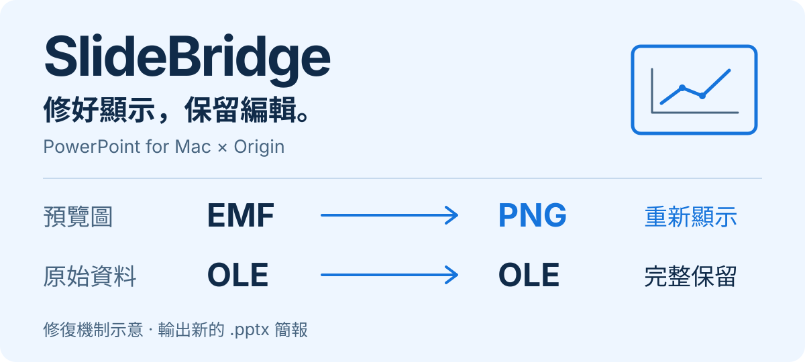

# SlideBridge

<p align="center">
  
</p>

[](https://github.com/Earth10514TW/SlideBridge/actions/workflows/ci.yml)
[](LICENSE)

**讓 Windows／Origin 圖表在 Mac PowerPoint 正常顯示，同時保留嵌入的編輯資料。**

SlideBridge 將 `.pptx` 裡的 EMF 預覽轉成 PNG，重新接上圖片關聯，保留原始 OLE 二進位並輸出新簡報。需要修改圖表時，也能透過 Parallels 把 Origin OLE 送到 Windows 編輯，再將資料與預覽成對寫回；橋接過程不需要 Windows PowerPoint。

[快速開始](#快速開始) · [App 與 PowerPoint 整合](#app-與-powerpoint-整合) · [Origin 編輯](#origin-編輯) · [備份與回復](#備份與回復) · [限制](#限制與相容性)

## 一份簡報，兩種工作

| 你想做的事 | SlideBridge 的處理方式 |
| --- | --- |
| 修好 Mac 上顯示異常的圖表 | EMF → SVG → PNG；預設 300 DPI，保留 OLE，另存為新簡報 |
| 從 Mac 編輯 Origin 圖表 | 抽出 OLE → Windows VM 內編輯 → OLE 與預覽成對回寫 |

安裝完成後，修復只需一行：

```sh
python3 -m slidebridge fix input.pptx
# 產生 input_fixed.pptx；不覆寫原稿
```

**既有驗證**：專案曾以真實 `Origin95.Graph` 簡報驗證 5 個 OLE 位置、4 份嵌入資料：修復後在 Mac PowerPoint 正常顯示，Windows + Origin 可雙擊編輯。這是特定樣本的驗證，其他 OLE 變體仍需實際檢視。

## 快速開始

### 1. 從原始碼準備修復工具

需要 macOS、**Python 3.10+**、Homebrew 與 Xcode Command Line Tools（尚未安裝時執行 `xcode-select --install`）。Python 核心只用標準函式庫；EMF 轉換另外使用本機 `emf2svg-conv` 與 `resvg`。

```sh
git clone https://github.com/Earth10514TW/SlideBridge.git
cd SlideBridge

brew install python resvg cmake libpng argp-standalone
bash scripts/build_patched_emf2svg.sh
```

建置腳本會下載上游 libemf2svg、套用專案修補，產生 `bin/emf2svg-conv`**。原始碼 checkout 不包含 `bin/`、`dist/` 的編譯產物**；App 與 Windows Helper 依下方步驟另行建置。

### 2. 掃描並修復簡報

在 checkout 目錄執行，將 `input.pptx` 換成你的簡報路徑：

```sh
python3 -m slidebridge scan input.pptx --json
python3 -m slidebridge fix input.pptx

# 指定輸出位置與解析度
python3 -m slidebridge fix input.pptx -o output.pptx --dpi 600
```

開啟輸出的簡報，確認圖表、文字與透明背景。`scan` 列的是封裝內的 EMF／WMF 庫存；修復後保留的原始圖檔也會被列出，不代表修復失敗。

<details>
<summary>CLI 安裝、自訂 renderer 與 Homebrew 發布</summary>

在 Python 虛擬環境執行 `python3 -m pip install -e .` 後，可將 `python3 -m slidebridge` 簡寫成 `slidebridge`；直接從 checkout 執行模組則不需 pip 安裝。

```sh
python3 -m slidebridge fix input.pptx --renderer /path/to/resvg
```

`packaging/homebrew/` 提供 Formula／Cask **發布模板**，仍含待填的版本雜湊。建立可用 Tap、補齊轉換器封裝與 Release 後，才能作為安裝入口；詳見 [Homebrew 發布指南](packaging/homebrew/README.md)。

</details>

## App 與 PowerPoint 整合

目前原生 App 的建置目標為 **macOS 13+、Apple Silicon**。

```sh
# 接續快速開始；安裝服務選單並建置 App
bash scripts/install_mac_integration.sh
open dist/SlideBridge.app
```

- **批次修復**：拖曳 `.pptx` 進 App，使用 300 DPI PNG 修復並保留 OLE。
- **服務選單編輯**：在 Mac PowerPoint 選取 Origin 圖表，開啟 `Microsoft PowerPoint → 服務 → 在 Origin 編輯 (SlideBridge)`。
- **雙擊編輯**：保持 SlideBridge 開啟，授予「輔助使用」權限，並確認 Origin 編輯頁顯示「監聽中」。App 會接管 PowerPoint 的 OLE 錯誤對話框並啟動橋接；錯誤視窗可能短暫出現。

後兩種操作需先完成下方的 Windows／Origin 環境設定。初次觸發服務時，依 macOS 提示允許自動化。

<details>
<summary>服務選單、權限與專案搬移排查</summary>

- 服務選單找不到項目：到「系統設定 → 鍵盤 → 鍵盤快速鍵 → 服務」確認已勾選。
- App 顯示「需要輔助使用權限」：到「隱私權與安全性 → 輔助使用」允許 SlideBridge；授權後會自動重新連線。
- 重新編譯後權限失效：移除設定中的舊 App 項目，再加入目前的 `dist/SlideBridge.app`。
- checkout 搬移後：重跑 `bash scripts/install_mac_integration.sh`，更新系統整合記錄的路徑。

</details>

## Origin 編輯

### 準備 Windows 環境

需要 **Parallels Desktop**、執行中的 Windows VM、已安裝的 Origin／OriginPro，以及 Mac 家目錄共享（`\\Mac\Home`）。一鍵編輯目前僅支援 Parallels；UTM、VMware Fusion 與 VirtualBox 可被偵測，但不支援此流程。

在 Mac 建置 Windows Helper：

```sh
brew install mingw-w64
bash scripts/build_origin_bridge.sh
python3 -m slidebridge doctor
```

Helper 輸出為 `dist/origin-bridge.exe`。`doctor` 會檢查 Python、resvg、系統整合、PowerPoint、VM 與 Helper，並附上失敗項目的修復方式；也接受 `--json`。它檢查的是完整編輯環境，單純使用 CLI 修復時不需備齊所有橋接項目。

### 選圖、編輯、寫回

```sh
# 從指定簡報選擇圖表，預設產生 presentation_updated.pptx
python3 -m slidebridge edit presentation.pptx

# 編輯 PowerPoint 目前選取的圖表，原地更新並保留備份
python3 -m slidebridge edit-active
```

1. 選取要編輯的 Origin 圖表，執行指令或觸發 PowerPoint 服務選單。
2. 在 Windows Origin 修改圖表，按 **Ctrl+S** 存檔。
3. 點 Helper 的 **Save and Close**；它會自動匯出預覽，再由 Mac 成對寫回 OLE 與圖片。從 PowerPoint 觸發時會自動重新載入並回到原投影片。

`byte-identical` 表示資料沒有變化：請確認已在 Origin 存檔，且圖表確實有修改。回寫要求資料與預覽成對存在，並使用暫存檔原子替換。

`edit` 與手動 `writeback-ole` 預設比對來源簡報及 OLE 的 SHA-256，拒絕來源衝突。`edit-active` 因 PowerPoint 會重新存檔，刻意略過這兩項雜湊檢查；編輯期間請避免另行修改同一份簡報。未變更內容的檢查仍保留。

<details>
<summary>手動抽取、成對回寫與 session 路徑</summary>

```sh
python3 -m slidebridge prepare-ole input.pptx \
  --member ppt/embeddings/oleObject1.bin -o .cache/ole-session --json

# 在 Windows 編輯並準備好更新的 OLE 與預覽後
python3 -m slidebridge writeback-ole input.pptx \
  --session .cache/ole-session -o updated.pptx --json
```

`prepare-ole` 產生 `original.bin`、`editable.bin`、`manifest.json`。`writeback-ole` 要求 OLE 與對應預覽成對存在，來源衝突預設拒絕；`--in-place` 可原地更新並先留備份。

一鍵編輯的 session 必須在家目錄內，Windows guest 才能透過共享路徑存取。預設使用 `.cache/sessions`；checkout 在家目錄外時改用 `~/Library/Caches/SlideBridge/sessions`。`--session` 可自訂，但不能指向家目錄外。

完整協定與 Windows 操作方式見 [Origin OLE 橋接文件](docs/origin-bridge.md)。

</details>

## 備份與回復

`edit-active` 與 `--in-place` 會更新原稿，更新前先留快照，存放於：

```text
~/Library/Application Support/SlideBridge/backups/
```

預設保留 **7 天、每份簡報最多 5 份**，在後續寫入時清理；可透過 `SLIDEBRIDGE_BACKUP_RETENTION_DAYS` 與 `SLIDEBRIDGE_BACKUP_KEEP` 調整。

從 App 的「備份與回復」卡片操作，或使用 CLI：

```sh
python3 -m slidebridge backups list presentation.pptx
python3 -m slidebridge backups restore presentation.pptx
```

省略 `list` 的簡報路徑可查看所有快照；`restore --id <id>` 可選擇特定版本。回復前也會備份目前版本，讓回復操作可再還原。確認不再需要時，用 `backups clear [presentation.pptx]` 清除，或由 App 的 File 選單刪除所有備份。

## 限制與相容性

- **WMF 預設略過自動轉換**。原樣保留於封裝內；可先在 Windows 轉成 EMF，或以下方 `--preview` 指定 PNG。
- **PNG 仍是點陣圖**。預設依原始尺寸產生 300 DPI，libemf2svg 路徑最長邊上限為 4096 px；放大後受解析度限制。
- **保留 OLE 不代表所有版本都相容**。需在 Mac PowerPoint 檢視顯示，並在 Windows + Origin 驗證編輯；缺少或損壞的預覽、遺失的外部 linked OLE 資料無法重建。
- **修改會使原有數位簽章失效**。PowerPoint Add-in 與 Word 整合尚未實作。

### 使用 Windows 匯出的原圖

若自動轉換仍有外觀差異，可提供 Windows／Origin 匯出的 PNG；它會保留 PNG bytes、解析度與透明度，沿用原有位置、尺寸與裁切。

```sh
python3 -m slidebridge fix input.pptx -o windows-previews.pptx \
  --preview 'ppt/media/image5.emf=/path/to/windows-chart.png'
```

`--preview` 可重複使用，只接受封裝中已存在的 EMF／WMF 路徑；其他圖片仍走自動轉換。請提供完整圖框、長寬比相符的 PNG。`--json` 可區分 `reference-png` 與 `rendered`。

`--no-transparent` 只略過白色邊界去背，不會把 renderer 原有的透明區域填白。

## 開發與驗證

核心在 `slidebridge/`，原生 App 在 `mac/SlideBridgeApp/`，Windows Helper 在 `native/origin-bridge/`；`patches/` 包含 EMF 線寬、旋轉文字與 XOR 網底等修補。

```sh
# Python 單元測試；未指定轉換器時略過原生 EMF 測試
python3 -m unittest discover -s tests -v

# 包含原生 EMF 渲染驗證
SLIDEBRIDGE_TEST_EMF2SVG=bin/emf2svg-conv python3 -m unittest discover -s tests -v

# Swift 輔助使用攔截策略回歸測試
bash tests/swift/run_ppt_alert_policy_tests.sh

# 真實樣本的 PPTX 封裝完整性比對
python3 scripts/verify_package.py input.pptx input_fixed.pptx
```

單獨重建 App：`bash scripts/build_mac_app.sh`。Windows Helper 的 C++ 持久化測試見 [橋接文件](docs/origin-bridge.md)；自動化檢查見 [CI](https://github.com/Earth10514TW/SlideBridge/actions/workflows/ci.yml)。

## 文件與授權

[Origin OLE 橋接](docs/origin-bridge.md) · [效能量測](docs/backend-performance.md) · [轉換器修補紀錄](docs/converter-checkpoint.md) · [Homebrew 發布](packaging/homebrew/README.md)

依據 [GNU GPL v2](LICENSE) 授權。轉換管線使用 [libemf2svg](https://github.com/kakwa/libemf2svg) 與 [resvg](https://github.com/linebender/resvg)；PPTX OLE 結構可參考 [Microsoft 文件](https://learn.microsoft.com/en-us/dotnet/api/documentformat.openxml.presentation.oleobject)。
